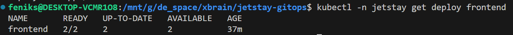
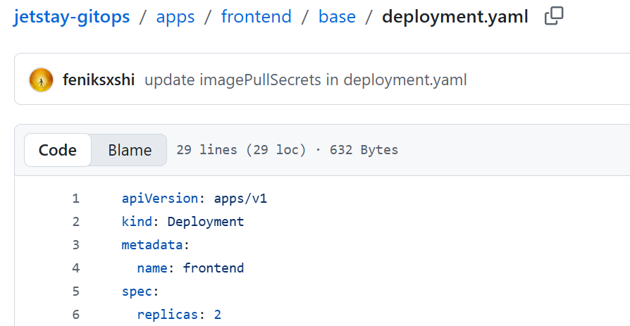

# jetstay-gitops

> Term: \
> File manifest: là file cấu hình YAML mô tả trạng thái mong muốn của resource trên K8s

## Ensure website run in local 

## Github Image Registry
kubectl create secret docker-registry github-registry-secret \
  --docker-server=ghcr.io \
  --docker-username=YOUR_GITHUB_USERNAME \
  --docker-password=YOUR_GITHUB_TOKEN \
  -n jetstay

## App-of-apps
ArgoCD implements auto-sync which means its child apps are sync automatically
 

After waiting for a bit, I got all healthy applications

> In Argocd, the difference between 'Healthy', 'Degraded' and 'Progressing' is

<!-- kubectl -n argocd describe application jetstay-mysql -->
<!-- download CRDs for backend application -->

## Test GitOps self-heal và rollback
### Self-heal
Sửa tay replica trong cluster:

Sửa tay trong cluster sẽ bị ArgoCD ghi đè vì Git là source of truth.

## Rollback using git revert
Sửa apps/frontend/base/deployment.yaml:

Commit: \
git add . \
git commit -m "scale frontend to 3" \
git push \