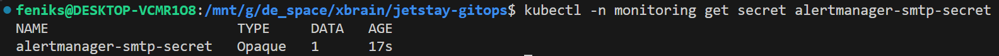
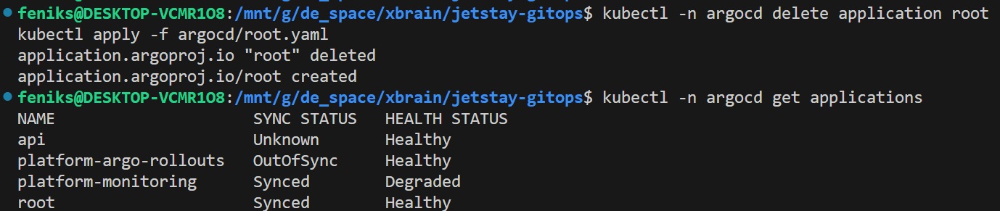

# My notes
## Gitops 

> **Flow**: Developer push manifest → Git lưu → ArgoCD detect → Apply vào K8s → Pods chạy. Không kubectl tay.

# Project

## Test app Python locally
Test health: 

Test metrics: 

## Build Docker image 
File Dockerfile
Build image: \
docker build -t todonoon-python:v1 .

Run and it works:

## Push image into Github Container Registry

## ArgoCD app-of-apps
Check secret: 

